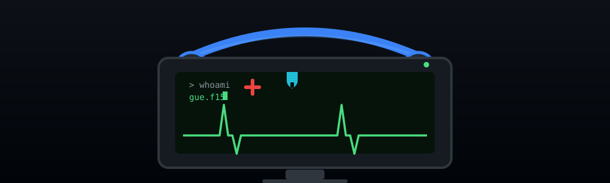
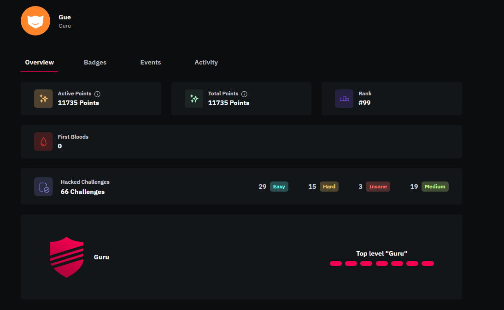

 

 

## 👋 About Me

- 🩺 **Nursing student**
- 🛡️ **Hobby: Cybersecurity**
- Interests: CTF, Digital Forensics (DFIR), Reverse Engineering, Penetration Testing.

---

## 🚩 CTF

Competing on **FlagYard**:

---

## 💻 Skills & Interests

| Area | Tools |
|---|---|
| 🔬 **Digital Forensics & IR** | Wireshark, Volatility, Autopsy |
| 🔄 **Reverse Engineering** | Ghidra, IDA |
| 🎯 **Penetration Testing** | Nmap, Burp Suite, Metasploit, SQLMap |
| ⚙️ **Labs / Systems** | Linux, Bash, Python, Git, VS Code |

 

---

<!-- Snake animation, generated by GitHub Actions after the first run -->
<picture>
  <source media="(prefers-color-scheme: dark)" srcset="https://raw.githubusercontent.com/Gue-F15/Gue-F15/main/dist/github-contribution-grid-snake-dark.svg" />
  <source media="(prefers-color-scheme: light)" srcset="https://raw.githubusercontent.com/Gue-F15/Gue-F15/main/dist/github-contribution-grid-snake.svg" />
  
</picture>

 

## 📫 Contact

 

 

  

